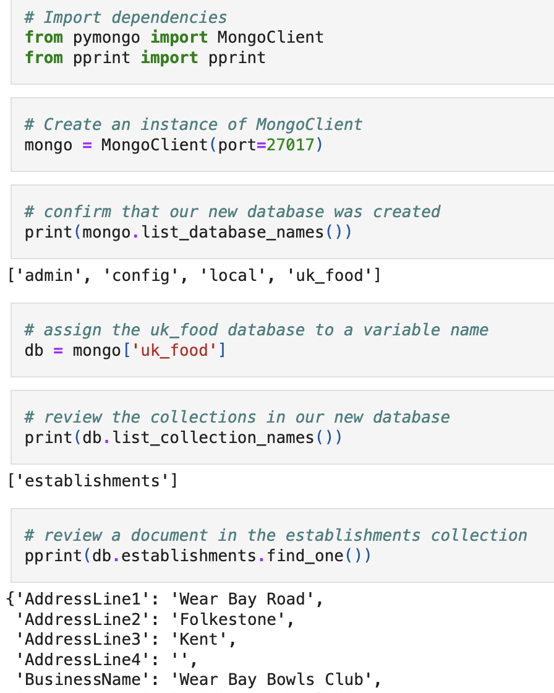
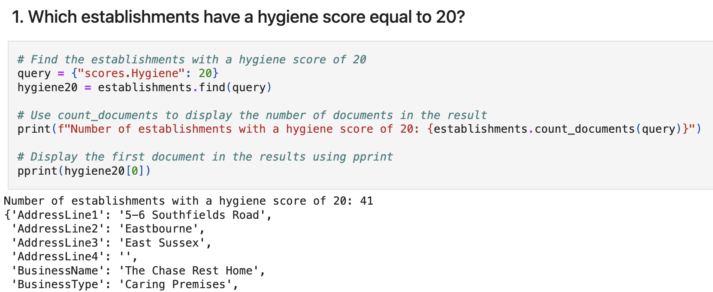

# nosql-challenge
UK Food Hygiene Rating Analysis

## Contents
1. [Overview](#1-overview)
2. [Repository](#2-repository)
3. [Deployment](#3-deployment)
4. [Analysis](#4-analysis)
5. [Reference & Credits](#5-reference--credits)


## 1. Overview
The UK Food Standards Agency assesses food hygiene ratings for establishments across the United Kingdom. This challenge analyses data from the agency to help journalists at *Eat Safe, Love* identify key insights for articles. The analysis is carried out using MongoDB and Jupyter Notebooks, focusing on data manipulation, updates, and exploratory queries.



## 2. Repository
The repository includes:
- **Data**: `resources/establishments.json` file containing the dataset.
- **Setup Notebook**: [`NoSQL_setup.ipynb`](NoSQL_setup.ipynb) for database setup and data cleaning.
- **Analysis Notebook**: [`NoSQL_analysis.ipynb`](NoSQL_analysis.ipynb) for exploratory data analysis.

## 3. Deployment

### General Instructions
1. Ensure that the necessary Python libraries (`pymongo`, `pprint`, `pandas`) are installed on your system.
2. Ensure that MongoDB is installed.
3. Download the repository.
4. Open and run the notebooks (`NoSQL_setup.ipynb` and `NoSQL_analysis.ipynb`) in Jupyter Notebook.

### `NoSQL_setup.ipynb`
#### Part 1: Database and Jupyter Notebook Set Up
1. Import the data from the `establishments.json` file into MongoDB.
   - In the terminal, navigate to the folder that contains `establishment.json`. If the folder is `resources/`, type the following command:
   ```
   cd resources
   ```
   - Type the following command to import the data provided in the `establishments.json`. The database is named `uk_food` and the collection is named `establishments`.
   ```
   mongoimport --type json -d uk_food -c establishments --drop --jsonArray establishments.json
   ```
2. Ensure database and collection setup is complete, with verification steps.

#### Part 2: Update the Database
1. Add a new document for a halal restaurant, *Penang Flavours*.
2. Fill in missing `BusinessTypeID` data for *Penang Flavours*.
3. Update the data types of specific fields (latitude, longitude, and RatingValue).

### `NoSQL_analysis.ipynb`
#### Part 3: Exploratory Analysis
Perform the data analysis to answer specific questions outlined in the next section.

## 4. Analysis
The following questions were answered in the Analysis Notebook [`NoSQL_analysis.ipynb`](NoSQL_analysis.ipynb):

1. Which establishments have a hygiene score equal to 20?

   **Hygiene Score 20**: Establishments with a hygiene score of 20 indicate a high level of concern in hygiene practices. This analysis helps identify establishments requiring significant improvements.

2. Which establishments in London have a RatingValue greater than or equal to 4?

   **High Rating in London**: Identifying highly-rated establishments in London assists journalists in highlighting exemplary places for food hygiene.

3. What are the top 5 establishments with a RatingValue of 5, sorted by lowest hygiene score, nearest to the new restaurant added, "Penang Flavours"?

   **Top Nearby Establishments**: This query helps find highly-rated establishments in the vicinity of *Penang Flavours*, sorted by hygiene scores to recommend cleaner options.

4. How many establishments in each Local Authority area have a hygiene score of 0? Sort the results from highest to lowest, and print out the top ten local authority areas.

   **Hygiene Score by Authority**: Counting establishments with a hygiene score of 0 by local authority reveals areas with significant issues and potential focus for food safety improvements.



## 5. Reference & Credits
- **Dataset**: Provided by the UK Food Standards Agency. https://www.food.gov.uk
- **MongoDB**: For database management and queries.
- **Python Libraries**: Used PyMongo, Pretty Print, and Pandas for data manipulation and analysis.
